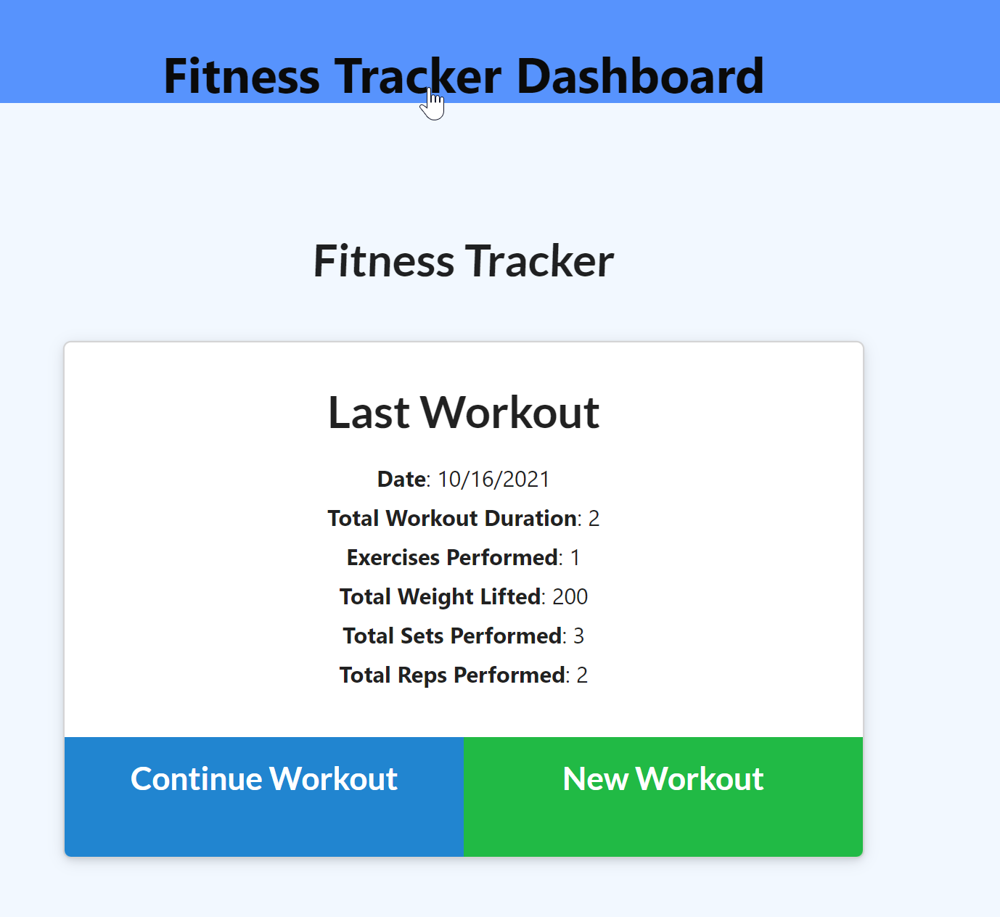

# Unit 18 Nosql Homework: Workout Tracker

## Task
For this assignment, we're asked to create a Mongo database with a Mongoose schema and handle routes with Express for a **workout/fitness tracker** from already provided front end code in the `Develop` folder.

## Business Context

A consumer will reach their fitness goals more quickly when they track their workout progress.

## User Story

```
AS A user
I WANT to be able to view create and track daily workouts
I WANT to be able to log multiple exercises in a workout on a given day
I also WANT to be able to track the name, type, weight, sets, reps, and duration of exercise
I WANT to be able to track my distance traveled, if the exercise is a cardio exercise
```


## Acceptance Criteria

```
WHEN the user loads the page, they should be GIVEN the option to create a new workout or continue with their last workout.

✓ Add exercises to the most recent workout plan.
✓ Add new exercises to a new workout plan.
✓ View the combined weight of multiple exercises from the past seven workouts on the `stats` page.
✓ View the total duration of each workout from the past seven workouts on the `stats` page.
```

--------------------------------
# DNB's SOLUTION: 
UNC Boot Camp Submission: 🗂️ [Github Repository](https://github.com/DionneNoellaBarretto/18-FitnessTracker_Mongo-NoSQL-_Mongoose_Express_FullStack) | 📄[Heroku Page]()

--------------------------------

### ResponseUI Solution - Desktop, Tablet & Mobile Views
Starting Screen: 
Drop Down Options: 
Resistance Wizard Screen: 
Cardio Wizard Screen: 
Workout Dashboard Screen: 

## Grading Requirements

You are required to submit the following:
```
✅ The URL to the deployed application
✅ The URL to the GitHub repository
```